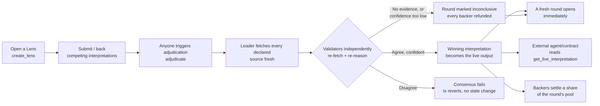

# Lens

**A real-time interpretation engine for high-stakes information streams.**

Anyone — human or agent — opens a Lens on a concrete source or domain. Participants stake capital
behind competing structured interpretations of it. GenLayer adjudicates which interpretation best
fits the live evidence. The winner becomes the Lens's live output, readable by any external agent
or contract — and unlike a one-shot resolution, the Lens never stops: adjudication opens a fresh
round every time, so the live output keeps tracking the source as it evolves.

Not a prediction market. Not a court. Not simple escrow — infrastructure for shared, capital-backed,
continuously updatable interpretation of complex information.

- **Network:** GenLayer Bradbury testnet
- **Contracts:** [`contracts/LensFactory.py`](contracts/LensFactory.py), [`contracts/Lens.py`](contracts/Lens.py)
- **Live app:** https://lens-x9.vercel.app

## The trust problem

Complex, fast-moving information (a market narrative, a live filing, a developing dataset) rarely
has one obvious "correct" reading — but agents and protocols still need *something* stable to act
on. Today that's either:

1. **A single trusted source's take** — fast, but a single point of failure and a single point of
   bias, with no mechanism for anyone to challenge it with a better-evidenced alternative.
2. **No shared interpretation at all** — every agent reads the raw source itself and reasons
   independently, so no two agents necessarily agree on what's actually true right now.

Neither gives a protocol a way to say *"defer to whichever interpretation of this source the
strongest evidence and the most rigorous adjudication currently support"* — and have that answer be
capital-backed (participants have skin in the game) and continuously current (it updates as the
source does), not a stale snapshot.

## The solution



A round nobody ever adjudicates is never stuck either: `cancel_round()` (after 24h) or
`close_lens()` (immediately) both unlock the same refund path.

No interpretation becomes the live output on one model's say-so — it becomes canonical only once
independent validators, each fetching the live evidence themselves, agree it's the strongest fit.

## Why this needs GenLayer

Selecting "the interpretation that best fits the evidence" is a judgment call, not a deterministic
computation — it requires reading natural-language claims against freshly fetched, unstructured web
content. A single off-chain oracle making that call just relocates the trust problem to whoever runs
it. GenLayer's Equivalence Principle is what makes the judgment cryptoeconomically trustworthy: the
live output only changes once a majority of independent validators, each doing their own reasoning
against the same freshly fetched evidence, reach the same conclusion.

## How to use it

**1. Open a Lens** (any address may call this; at least 2 sources are required — a single,
possibly self-controlled URL isn't enough to adjudicate against):

```
LensFactory.create_lens(sources, interpretation_type, title, description) -> address
```

Sources are append-only afterward — anyone can call `Lens.add_source(url)` to add a corroborating
or contradicting one, permissionlessly, at any time.

**2. Submit or back an interpretation** (any address, staking GEN):

```
Lens.submit_interpretation(content, structured_claims) -> interpretation_id
Lens.back_interpretation(interpretation_id)
```

**3. Trigger adjudication** (any address may call this — there's no special "adjudicator" role):

```
Lens.adjudicate() -> winning interpretation_id
```

**4. Read the live output** (no gas, anyone, including other contracts):

```
Lens.get_live_interpretation() -> { has_live, interpretation, reasoning }
```

**5. Settle** (backers of the winning interpretation) — or, if a round never gets a decisive winner
(no fetchable evidence, low confidence, a timeout, or the Lens closing), every backer gets a full
refund through the same `claim()` call instead:

```
Lens.settle(round)      # only for a round that reached a decided winner
Lens.claim(round)       # parimutuel payout, or a straight refund -- never stranded
```

Full details in [`docs/AGENT_SDK.md`](docs/AGENT_SDK.md).

## Repository structure

```
lens/
├── contracts/          LensFactory.py, Lens.py
├── tests/
│   ├── direct/          72 passing tests against gltest's WASI mock
│   └── integration/     Tests against a real GenLayer node (factory deploy flow)
├── frontend/            Next.js 15 App Router application
├── deploy/              Deployment scripts
├── docs/                ARCHITECTURE.md, RESOLUTION_LOGIC.md, AGENT_SDK.md, AUDIT.md
├── gltest.config.yaml
├── package.json
└── pyproject.toml
```

## Local development

```bash
# Contracts
pip install .
genvm-lint check contracts/Lens.py
genvm-lint check contracts/LensFactory.py
gltest tests/direct -v

# Frontend
npm install
npm run dev --workspace=frontend
```

See [`docs/ARCHITECTURE.md`](docs/ARCHITECTURE.md) for the full system design, storage
constraints, and rationale behind every deliberate deviation from the naive implementation,
[`docs/RESOLUTION_LOGIC.md`](docs/RESOLUTION_LOGIC.md) for a line-by-line walkthrough of
`adjudicate()`, and [`docs/AUDIT.md`](docs/AUDIT.md) for a self-adversarial review pass calibrated
against real GenLayer reviewer rejection language, and every fix it produced.

## License

MIT
