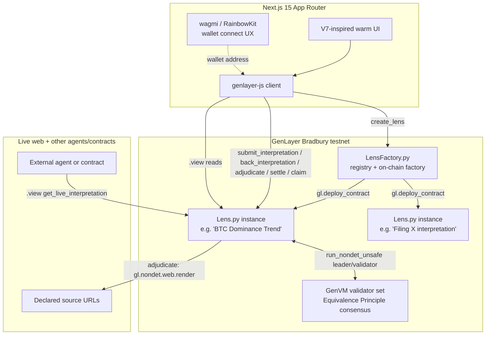

# Architecture

## System overview

## Contract architecture

Two contracts, following the verified `genlayerlabs/intelligent-oracle` factory pattern (same
`py-genlayer` dependency hash independently confirmed live on Bradbury across multiple prior
projects on this stack):

- **`LensFactory.py`** — a registry that deploys a fresh `Lens` contract per opened Lens via
  `gl.deploy_contract(code=lens_source.encode("utf-8"), args=[...], salt_nonce=...)`. Lens source
  is passed in as a constructor argument (`lens_code: str`) at LensFactory's own deploy time.
  Factory metadata (sources, interpretation type, title, description, creator) is stored once at
  creation and is **read-only** afterward — the factory has no way to be pushed live updates from
  a Lens (see "Why no cross-contract writes" below), so it never claims to know a Lens's current
  round, status, or live output. Callers read that directly from the Lens contract.
- **`Lens.py`** — a single Lens's full lifecycle: `submit_interpretation` / `back_interpretation`
  (payable, staking), `adjudicate` (the Equivalence Principle consensus step), `settle` / `claim`
  (post-adjudication settlement), and view methods (`get_lens_info`, `get_live_interpretation`,
  `get_round_interpretations`, `get_adjudication_log`, `get_claimable`, …).

## Why a Lens is round-based, not one-shot

A prediction market or a Claim resolves once. A Lens is explicitly designed to keep tracking a
source as it changes, so `adjudicate()` never terminates the contract's lifecycle — it closes the
current round (`round_status[round] = "adjudicated"`) and immediately opens a fresh one
(`current_round += 1`, `round_status[new_round] = "open"`) so new interpretations can be submitted
and the live output can be re-adjudicated later against newer evidence. `live_interpretation_id`
always points at the most recent winner regardless of which round it came from — that is the
Lens's current live output, the one field external readers care about.

Each round has its own interpretation pool, so a round that lost adjudication doesn't drag down
future rounds, and a round's stake is settled independently via `settle(round)` / `claim(round)`.

## Storage design

Every persistent field uses only `TreeMap[str, str]` (JSON-encoded values) and `DynArray[str]` —
deliberately, not a style preference. Live testing on prior projects on this stack found that
`TreeMap` value types other than `str` — including `@allow_storage @dataclass` values and plain
scalars like `TreeMap[str, u256]` — deploy successfully (ACCEPTED consensus, looks completely
healthy) but become **permanently unreadable** on the current Bradbury GenVM build. This is a real,
reproduced, dated finding from this same toolchain, not speculation, and it drove every storage
decision in `Lens.py` and `LensFactory.py`.

Nested values (an interpretation's `structured_claims`, a round's `backers` dict) live as plain
JSON inside a single `TreeMap[str, str]` value, read-modify-written as a whole record on every
mutation — the same pattern used throughout every prior GenLayer project on this stack
(`policies` in Helm, `positions` in Equiv).

## Address normalization

Every address-keyed lookup (`interpretations[id].backers[addr]`, `claimed["{round}:{addr}"]`)
normalizes the caller-supplied address string to lowercase via `_normalize_address()` before using
it as a key, on both the write and the read side. `Address.as_hex` is an EIP-55-style checksum
(mixed case); comparing it against raw, unnormalized caller input is a confirmed real GenLayer
rejection pattern from a prior submission — a caller passing a differently-cased but equally valid
address (which is what most Web3 libraries do by default) would otherwise get a silent "not found"
instead of their real stake. `tests/direct/test_interpretation.py::test_backing_lookup_is_case_insensitive_to_address`
regression-tests this directly.

## Why no cross-contract writes

Cross-contract **write** calls (`gl.get_contract_at(addr).emit(...).some_method(...)`) reach
ACCEPTED consensus on the calling contract's own transaction, but the target contract's state never
actually changes — confirmed independently across multiple prior projects on Bradbury. Lens makes
**zero** cross-contract calls of any kind: it doesn't read from LensFactory, and LensFactory doesn't
read from any Lens. This is a deliberate simplification, not an oversight — a Lens is fully
self-contained precisely so any reader (this frontend, another agent, another contract) can settle
against it with one direct `.view()` call and no indirection through the factory.

## Adjudication consensus

`Lens.adjudicate()` uses `gl.vm.run_nondet_unsafe(leader_fn, validator_fn)` with a **hand-coded**
Python validator — not `gl.eq_principle.prompt_comparative`'s natural-language `principle` string.
`validator_fn` calls `leader_fn()` again, independently — re-fetching every declared source fresh
and re-running the LLM from scratch — then compares only `winner_id` (exact match) and `confidence`
(within a 0.15 tolerance, computed in real Python arithmetic). This matches the explicit fix for a
real, confirmed GenLayer rejection pattern from a prior submission: *"the validator checks only
verdict shape... it does not independently review the evidence... redesign the validator to
independently acquire and assess the evidence."* See `RESOLUTION_LOGIC.md` for the full walkthrough.

Both source-fetching and the LLM call happen **inside the single leader closure** passed to
`run_nondet_unsafe` — not as separate top-level nondet calls — because `genvm-lint` (and the real
portal reviewers, per documented rejection language) enforce exactly one non-deterministic block
per method. Multiple `gl.nondet.web.render` calls inside one leader function are fine; two
sequential top-level nondet calls in the same method are not.

## Settlement

Settlement is pull-based and parimutuel, scoped per round: `settle(round)` marks a round eligible
once it's been adjudicated; `claim(round)` lets each backer of the round's winning interpretation
withdraw `(their_stake_in_winner * round_pool) // winner_total_stake`. A backer of a losing
interpretation can still call `claim()` — it succeeds with a zero payout rather than reverting,
which both marks their claim as resolved and avoids a confusing error for a legitimate participant
who simply backed the wrong interpretation. GEN leaves the contract via
`_Recipient(gl.message.sender_address).emit_transfer(value=...)` — the verified contract-to-EOA
transfer pattern — with `claimed[...]` marked **before** the transfer (checks-effects-interactions).

## Frontend

Next.js 15 (App Router) + TypeScript strict + Tailwind v4. RainbowKit/wagmi own wallet-connect UX
only (address display, network chrome); all actual contract reads/writes go through `genlayer-js`,
bound to the connected wallet's real injected provider via `connector.getProvider()` (never
`window.ethereum` directly, and never a fresh ephemeral read account per call — both are confirmed
real GenLayer rejection patterns from prior submissions). Every write flow (`create_lens`,
`submit_interpretation`, `back_interpretation`, `adjudicate`, `settle`, `claim`) drives its UI off
one shared state machine (`lib/useTransactionLifecycle.ts`): `submitting → polling → success/error`,
polling real transaction status via `pollConsensusStatus` — never a fabricated progress bar
disconnected from the actual transaction. `adjudicate()` specifically requires `FINALIZED` (not
just `ACCEPTED`) before the UI presents the new live output as settled, since it's exactly the kind
of write whose output something else (an external agent, a settling contract) may act on.

## Known scaling limitations (stated, not hidden)

- **No global index across all Lenses' interpretations.** The Explorer walks
  `LensFactory.get_lenses()` and reads each Lens's cached metadata individually. Fine at testnet
  scale; a real index (subgraph-style, or a denormalized registry field) is the natural next step
  at production scale.
- **`claim()` loops over a round's interpretation list** to confirm the caller genuinely
  participated before paying out — bounded by `MAX_INTERPRETATIONS_PER_ROUND` (12), so it's a small,
  fixed-size scan, not unbounded growth.
